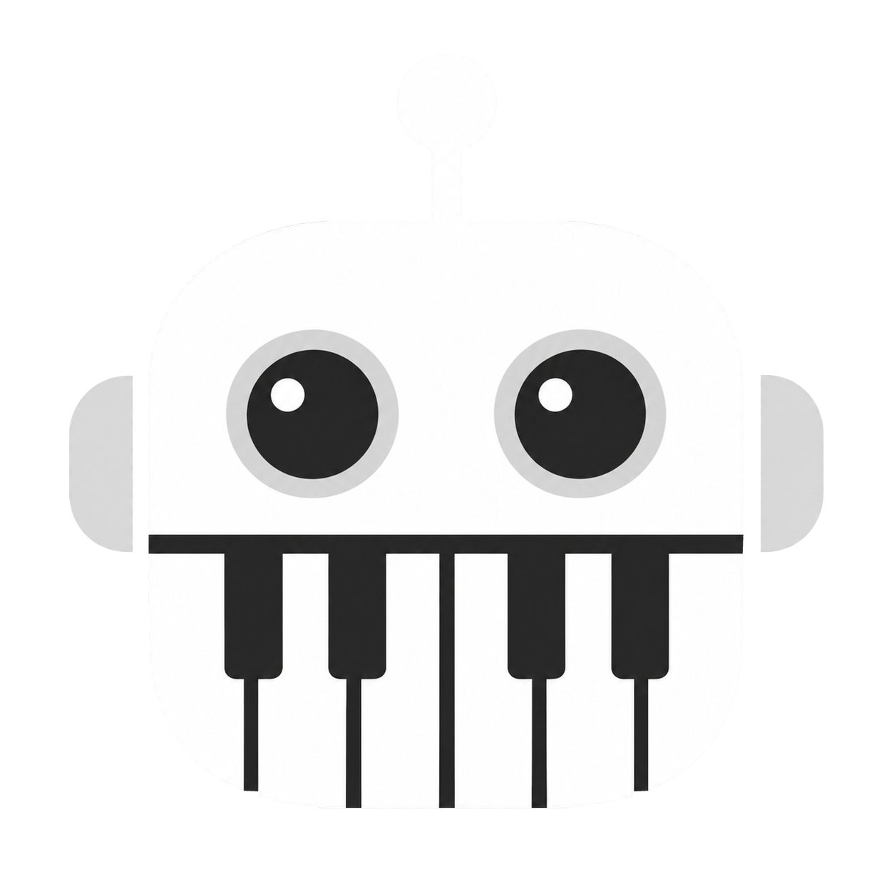
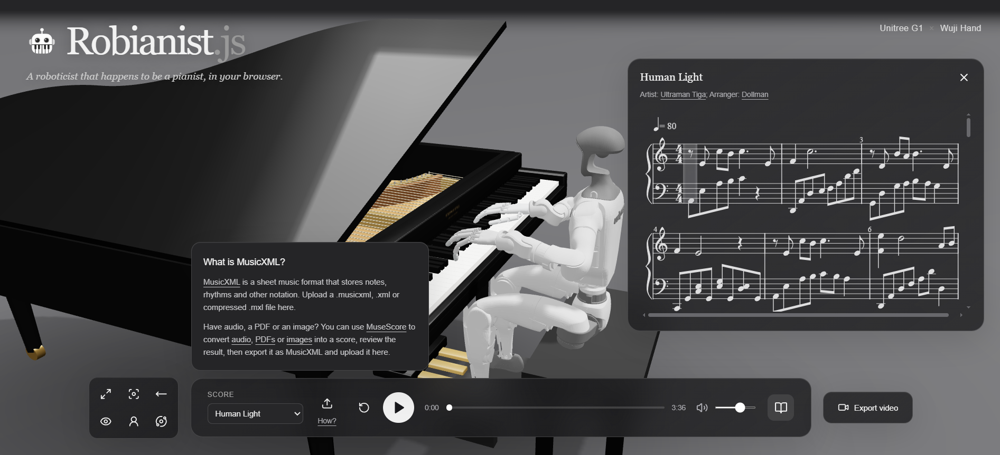

# Robianist.js



*A roboticist that happens to be a pianist, in your browser.*

## Demo



## For developers

### How it works

Built with React, Next.js, Three.js, and React Three Fiber.

The scene is [assembled](https://r3f.docs.pmnd.rs/) as a browser-based [3D stage](https://threejs.org/) containing a procedurally modeled grand piano, bench, lighting, and cameras.
The [Unitree G1 humanoid](https://github.com/unitreerobotics/unitree_ros/tree/master/robots/g1_description) and [Wuji hands](https://github.com/wuji-technology/wuji-description/tree/main/hand) are [imported](https://github.com/gkjohnson/urdf-loaders) from URDF and STL assets.
Preset or user-uploaded MusicXML/MXL scores are [parsed](lib/score.ts) into [timed piano-note events](lib/music.ts), [rendered](https://opensheetmusicdisplay.github.io/) as synchronized sheet music, and [scheduled](lib/player.ts) with [Web Audio](lib/audio.ts).
The [fingering planner](https://github.com/marcomusy/pianoplayer) assigns playable left- and right-hand contacts while preserving chord ordering, sustained notes, substitutions, and short lift gaps before repeated attacks.
For each hand, custom [seated-pose logic](lib/playing-pose.ts) first establishes a relaxed finger posture, curved ready poses for inactive fingers, fingertip-to-wrist offsets, and a wrist orientation aligned to the keyboard.
Active fingertip targets are then derived from the assigned keys, while the wrist target is computed from the active fingers' relaxed offsets and smoothed over time.
Custom [joint-limited damped-least-squares inverse kinematics](lib/arm-ik.ts) solves the arm joints for wrist position and orientation, then solves each finger joint chain for its assigned key; chord contacts are solved together with the shared arm chain.
The resulting angles are applied to the URDF hierarchy.

> MusicXML parsing is custom and currently supports single-part piano scores with up to two staves, pitches within A0–C8, multiple voices, chords, ties, tempo changes, octave shifts, and basic grace-note handling. Repeats must be unfolded in advance. Multi-part scores, transposing parts, repeat navigation, and expressive markings such as dynamics and pedal are not fully supported.
> 
> The demo does not validate balance, collision avoidance, or the reachability of every note. It directly resets joint configurations for visualization rather than executing motions through a robot controller, and should not be interpreted as a physically valid or deployable control system.
>
> Audio playback and robot motion are driven independently; neither directly controls or causes the other.

### How to run

Use Node.js and npm. From the repository directory:

```sh
npm ci
npm run dev
```

Open http://localhost:3000. Production and checks:

```sh
npm test
npm run build
```

The production build exports a static site to `out/`. Serve that directory with a static HTTP server; `next start` is not supported with static export.
